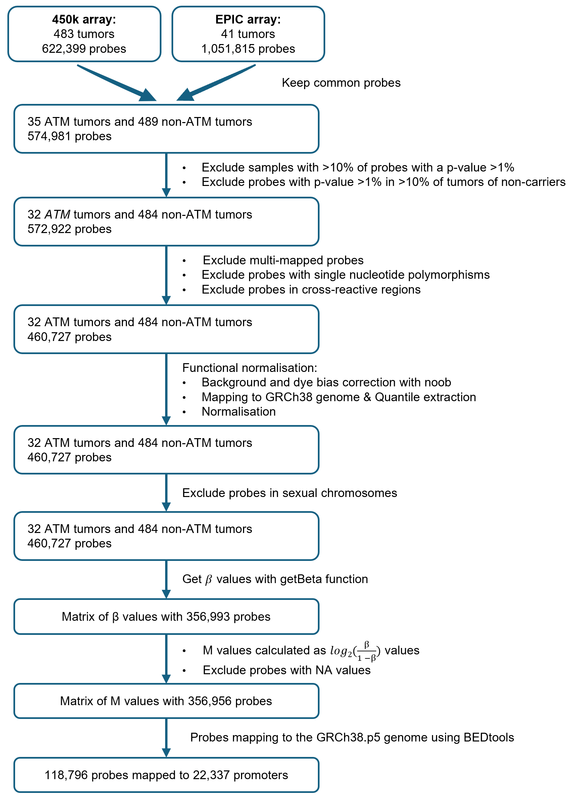

#  Preprocessing pipeline of methylation data (Illumina 450K and EPIC arrays)

This repository contains the code used for the paper Viart N. M. *et al.* (2025) entitled "Breast tumors from ATM pathogenic variant carriers display a specific genome-wide DNA methylation profile" published in Breast Cancer Research (https://doi.org/10.1186/s13058-025-01988-w)

## 1- Clone the repository
To be able to use the code of this repository, you have first to clone the repository with the command:
```
git clone https://github.com/nviart/Viart_ATM_breast_methylation.git
```

## 2- Package installation
This code is written in R language. The easiest way to use it with the same development environment is to use the versionning system renv (https://rstudio.github.io/renv/index.html). First install renv package if not done. Then, change in the config.R file the path to renv environment ("renv.path" variable). It will allow to load the environment in each of the other scripts. The R environment must be launched within the script folder.

## 3- Download the recquired files to run the pipeline
Some files need to be downloaded:
1. The files from Pidsley *et al.* (2016) that can be found here: https://github.com/sirselim/illumina450k_filtering
2. The manifest from Illumina named "infinium-methylationepic-v-1-0-b5-manifest-file.csv" that can be found here: https://support.illumina.com/downloads/infinium-methylationepic-v1-0-product-files.html
3. You also need bed files indicating the promoter, gene and CpG Islands regions that you want to study.

## 4- Modify the config file
The config.R file contains some variables that will be used by the other scripts. Set them according to your own environment.
You have to indicate:
* `Origin`: path to the files where will be saved the outputs of the pipeline
* `manifest.path`: path to the manifest file downloaded in step 2
* `onlyEPIC`: if only EPIC arrays will be used
* `EPICfolder`: the folder containig ALL your methylation arrays data
* `DescriptorFileName1` and `DescriptorFileName1`: the names of the csv descriptive files of the samples that should contain at least ....
* `probeFiltering`: boolean, if you want to filter the probes described in Pidsley *et al.* (2016) 
* `path.filters`: path to the files downloaded from https://github.com/sirselim/illumina450k_filtering

## 5- Run the pipeline
> **Note**
All the scripts are made to run on Torque PBS scheduler. You have to adapt the head of each script according to your environment.
  
### 5.1- Preprocessing pipeline
The preprocessing pipeline used in the paper Viart *et al.* (2025) is described in the chart below:
  

  
The script `1.Functional_normalisation.R` goes from the loading of the data to the matrix of M values.
Then, the script `2.Mapping.R` allows to map the M values to promoters, genes and CpG Islands using the bed files indicated in the config.R file.

  


